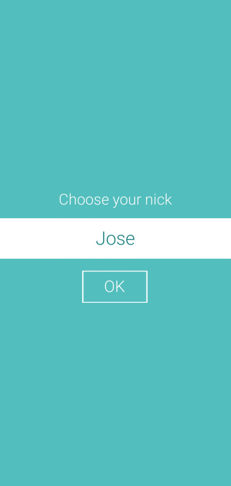
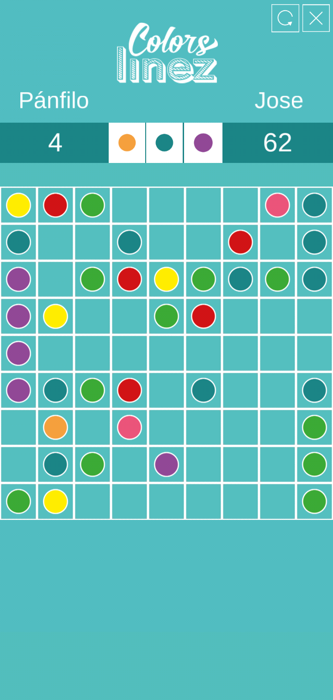

# ColorLines
Version of WinLines for Android. Developed in 2016 as a hobby and a gift to family members. The GUI was designed by: [Anabel Lorenzo Batista](https://belorenz.com)

## ScreenShots:

## Download
You can download the .apk for Android from the [bin/](/bin) folder, or just click [here](bin/ColorLines.apk).
You can trust the app, don't worry I'm  a nice person.
